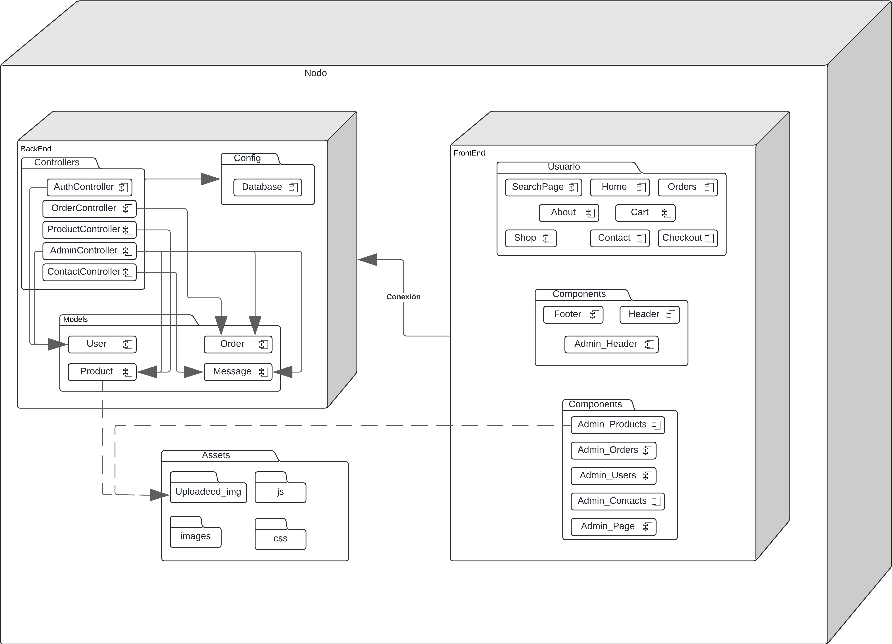

# Sistema FanPage

## UNIVERSIDAD PRIVADA DE TACNA
**FACULTAD DE INGENIERIA**  
*Escuela Profesional de Ingeniería de Sistemas*

### Proyecto Reportes FANPAGE
- **Curso:** Calidad y pruebas de software
- **Docente:** Mg. Patrick Cuadros Quiroga

### Integrantes
- Chambilla Zuñiga, Josue Abraham E. (2020067575)
- Llantay Machaca, Marjorie Garce (2020068951)

**Tacna – Perú**  
**2024**

### Documento Informe de Calidad
**Versión 1.0**

### Control de Versiones

| Versión | Hecha por | Revisada por | Aprobada por | Fecha | Motivo |
|---------|-----------|--------------|--------------|-------|---------|
| 1.0 | JACZ - MGLLM | JACZ - MGLLM | JACZ - MGLLM | 27/09/2024 | Versión Original |

## Índice
1. [Sistema FanPage](#sistema-fanpage)
2. [Universidad Privada de Tacna](#universidad-privada-de-tacna)
    - [Proyecto FANPAGE](#proyecto-fanpage)
    - [Integrantes](#integrantes)
    - [Documento Informe de Calidad](#documento-informe-de-calidad)
    - [Control de Versiones](#control-de-versiones)
3. [Título](#titulo)
4. [Autores](#autores)
5. [Planteamiento del problema](#planteamiento-del-problema)
    - [Problema](#problema)
    - [Justificación](#justificacion)
    - [Alcance](#alcance)
6. [Diagramas](#diagramas)
    - [Diagrama de casos de uso](#diagrama-de-casos-de-uso)
    - [Diagrama de Secuencia](#diagrama-de-secuencia)
        - [Usuario](#usuario)
        - [Administrador](#administrador)
    - [Diagrama de Clases](#diagrama-de-clases)
    - [Diagrama de Componentes](#diagrama-de-componentes)
    - [Diagrama de Despliegue](#diagrama-de-despliegue)
7. [Cobertura de Pruebas](#cobertura-de-pruebas)
8. [Referencias](#referencias)
    - [Frameworks de Testing](#frameworks-de-testing)

## Titulo
FANPAGE

## Autores
- Chambilla Zuñiga Josue Abraham E.
- Llantay Machaca Marjorie Garce

## Planteamiento del problema

### Problema
En la actualidad, muchas marcas y comunidades carecen de plataformas especializadas donde puedan vender productos exclusivos a sus seguidores de manera eficiente. Las plataformas de comercio generalistas no siempre permiten una personalización adecuada o una interacción directa con la comunidad. Esto dificulta la gestión de inventarios, la promoción de productos exclusivos y la fidelización de clientes.

### Justificación
FANPAGE busca cubrir esta necesidad creando una plataforma web personalizada para la venta de productos específicos, permitiendo a las marcas ofrecer una experiencia única a sus seguidores. La plataforma proporcionará herramientas para comprar lo que desees y poder realizar un feedback de los productos.

### Alcance
El proyecto FANPAGE abarcará la creación de una plataforma web que permita a los usuarios registrar sus cuentas, explorar productos, añadir artículos a su carrito de compras y realizar pagos de forma segura. Desde el lado administrativo, se incluirán funcionalidades para gestionar productos y órdenes de compra. El sistema también ofrecerá integración con diferentes métodos de pago y garantizará la protección de los datos de los usuarios.

## Diagramas

### Diagrama de casos de uso

### Diagrama de Secuencia
#### Usuario

#### Administrador

### Diagrama de Clases

### Diagrama de Componentes

### Diagrama de Despliegue

## Cobertura de Pruebas
### Antes SonarCloud

### Despues SonarCloud

### Comparativa Snyk

### Antes Semgrep

### Despues Semgrep

## Referencias

- The PHP Group. (2024). PHP Documentation. PHP. https://www.php.net/docs.php
- The PHP Group. (2022). PHP 8.2.0 Release Notes. PHP. https://www.php.net/releases/8.2/

### Frameworks de Testing
- Bergmann, S. (2024). PHPUnit Manual. PHPUnit. https://phpunit.de/documentation.html
- Behat. (2024). Behat Documentation. Behat. https://docs.behat.org/
- Kudryashov, K. (2024). Behat/Behat: BDD framework for PHP. GitHub. https://github.com/Behat/Behat
- Behat. (2024). MinkExtension - Behat Documentation. GitHub. https://github.com/Behat/MinkExtension
- Selenium. (2024). Selenium Documentation. Selenium HQ. https://www.selenium.dev/documentation/
- PHP WebDriver. (2024). PHP WebDriver Documentation. GitHub. https://github.com/php-webdriver/php-webdriver
- Dmore. (2024). Chrome Mink Driver. GitHub. https://github.com/dmore/chrome-mink-driver
- Emuse. (2024). BehatHTMLFormatter. GitHub. https://github.com/emuse/BehatHTMLFormatter